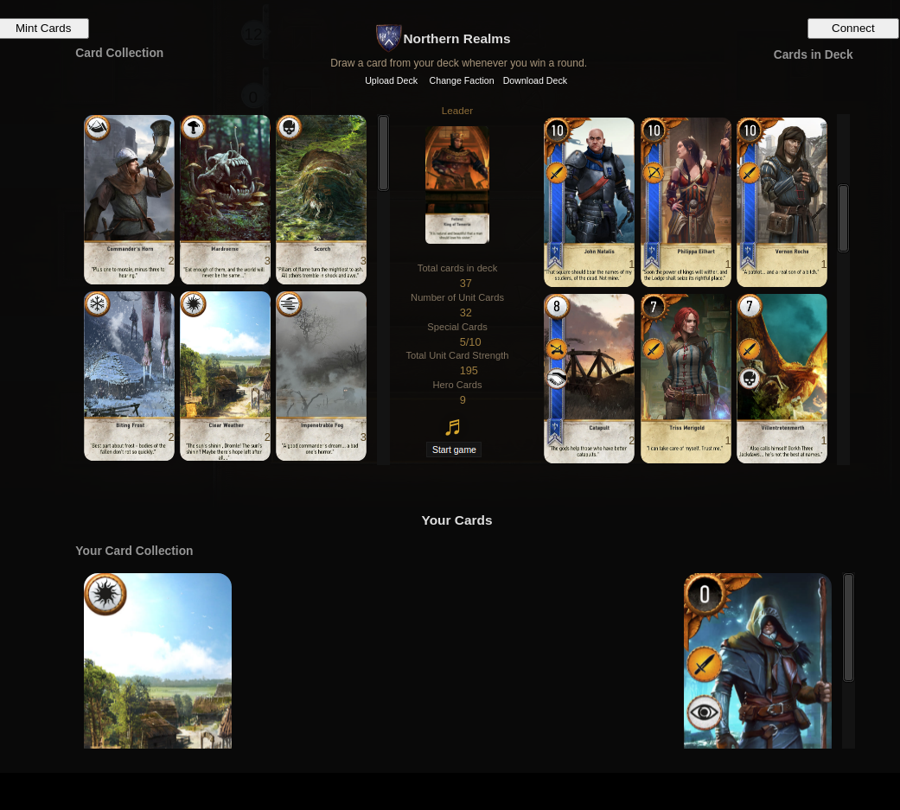
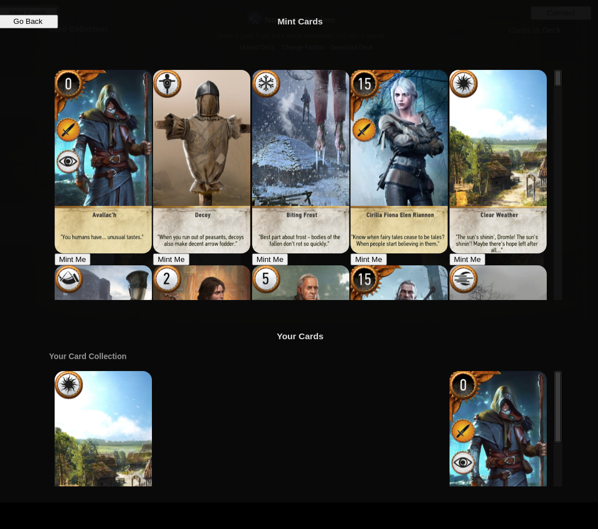

# Gwent v0.1

## Project Demo

Forked project from [gwent-classic](https://github.com/asundr/gwent-classic) but with blockchain and card NFTs!

### Ropsten Deployed Vannilla JS App
[https://gwent-eth.herokuapp.com/](https://gwent-eth.herokuapp.com/)
- please switch metamask network to ropsten testnet first (should prompt user)
- Now you are ready to mint, interaction details are under _Interaction Workflow_

### Demo Walkthrough Video
** TODO **

[https://youtu.be/U6djzW6sOnQ](https://youtu.be/U6djzW6sOnQ)

### Ethereum Address For Certification
- address: 0x9539F87b5A19753A002E01aE573A7A6d33561233

---

## Project Description

### About Gwent
Gwent is a turn-based card game between two players that can last two to three rounds. Players play one card each turn from a hand of 10 cards, chosen from a deck of 25. Each deck belongs to one of six factions that offer different play styles.

This gwent game uses the blockchain to mint and view your cards where you will be able to play and battle other gwent players or AI. 

**NOTE:**  The game is not coupled with NFTs and are currently sepearte

### Key Features
- Gwent Card Tokenization
    - `Gwent_card` NFT: security token (ERC-721)
        - represents ownership of card 
- view Gwent Card ownership
    - View your deck and see your minted Cards
- Minting Gwent Cards
    - Mint your Gwent Cards and create your ultimate Deck!

### High Level User Workflow
- Gwent Player
    1. Sign into metamask and change switch network to ropsten testnet
    2. Click Mint Cards
    3. mint one of your cards by clicking `mint me`
    4. You should see your newly minted card
    5. Go back

    **Extra:** Try playing the game, instructions are [here](https://github.com/asundr/gwent-classic)

### Tech Stack and Toolings
- smart contract development based on OpenZeppelin ERC-721
- using remix framework for smart contract development and testing
- using html/css/js stack and web3.js for frontend interaction

---

## Project Installation

### Prerequisites
- web-browser Chrome -- Other Browser may not work
- `git checkout main`
- npm

### Smart Contract
- open up remix `https://remix.ethereum.org/`
-  copy `/contracts/cards.sol` into remix
-  copy `/test/card_test.sol` into remix
-  compile `0.6.0 Solc version`
- deploy locally
- run the transaction, important functions `setMintAlive`, `mintCard` and `getDetails`

#### Testing
- Use Solidiy unit Testing plugin on Remix
- Run tests/card_test.sol
### Frontend Client
- `npm install`
- `npm start`
- open `http://localhost:3000`
- switch metamask network to Ropsten Network

### Interaction Workflow

1. Open client, either locally or the sever url https://gwent-eth.herokuapp.com/
2. Click `Mint Cards` to change pages to NFT
3. Mint a card of your choosing by clicking `Mint me` 
4. Follow the transaction steps of metamask
5. After waiting till your transaction success your newly minted card should now appear underneath the `Your Cards` section.
6. Well Done! Now go back and play gwent!

### Directory Structure
- `client`: html/css/js frontend of the project
- `contracts`: smart contracts
- `test`: tests for smart contracts
- `screenshots`: Holds the images for the `Readme.md`

---

## Future Improvements
- Make the game card selctor use the NFT minted cards ( Right now seperate) 
- hardcoded demo application -> customizable real-world application
- improve frontend user experience by refactoring code or by using a javascript framework like react
- Add ability to play with opponent through the blockchain rather than play against the AI