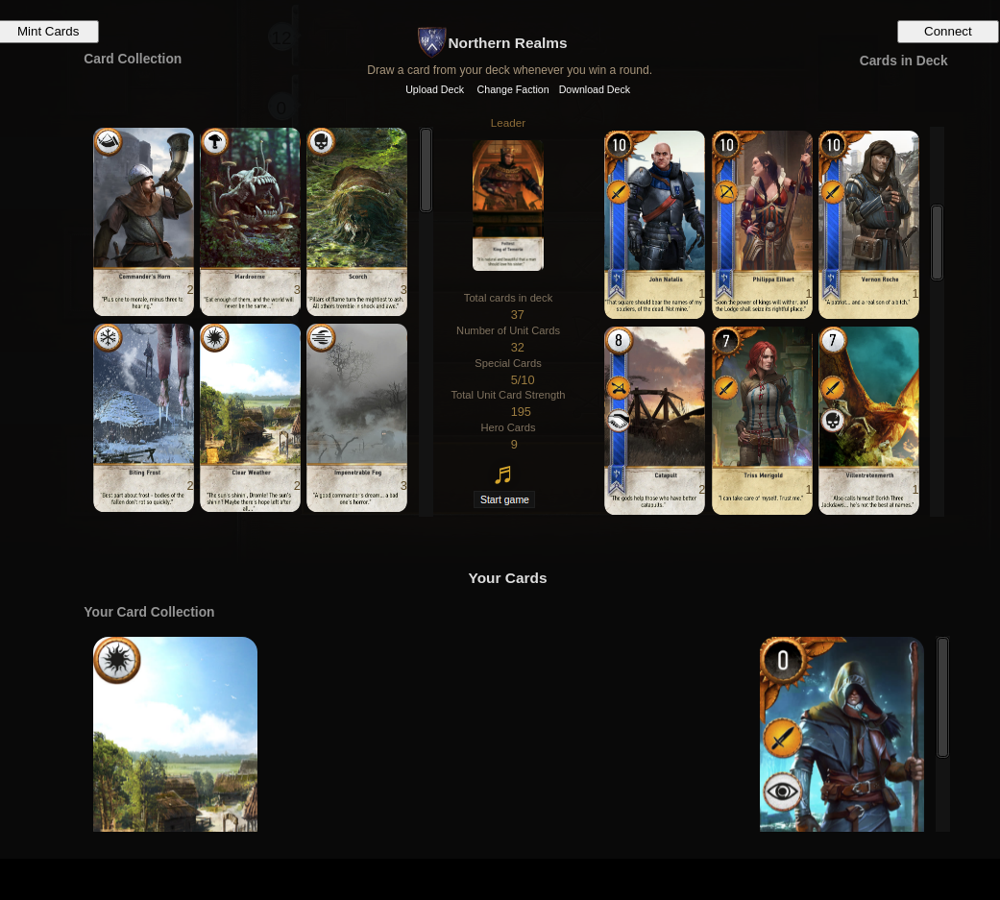

# Gwent v0.1

## Project Demo

Forked project from [gwent-classic](https://github.com/asundr/gwent-classic) but with blockchain and card NFTs!

### Ropsten Deployed Vannilla JS App
** TODO **

[https://gwent-eth.herokuapp.com/](https://gwent-eth.herokuapp.com/
- please switch metamask network to ropsten testnet first (should prompt user)
- Now you are ready to mint, interaction details are under _Interaction Workflow_

### Demo Walkthrough Video
** TODO **

[https://youtu.be/U6djzW6sOnQ](https://youtu.be/U6djzW6sOnQ)

### Ethereum Address For Certification
- address: 0x9539F87b5A19753A002E01aE573A7A6d33561233

---

## Project Description

### About Gwent
Gwent is a turn-based card game between two players that can last two to three rounds. Players play one card each turn from a hand of 10 cards, chosen from a deck of 25. Each deck belongs to one of six factions that offer different play styles.

This gwent game uses the blockchain to mint and view your cards where you will be able to play and battle other gwent players or AI.

### Key Features
- Gwent Card Tokenization
    - `Gwent_card` NFT: security token (ERC-721)
        - represents ownership of card 
- view Gwent Card ownership
    - View your deck and see your minted Cards
- Minting Gwent Cards
    - Mint your Gwent Cards and create your ultimate Deck!

### High Level User Workflow
- Gwent Player
    1. Sign into metamask and change switch network to ropsten testnet
    2. Click Mint Cards
    3. mint one of your cards by clicking `mint me`
    4. Refresh page, and you should see your newly minted card

### Tech Stack and Toolings
- smart contract development based on OpenZeppelin ERC-721
- using remix framework for smart contract development and testing
- using html/css/js stack and web3.js for frontend interaction

---

## Project Installation

### Prerequisites
- web-browser Chrome -- Other Browser may not work
- `git checkout main`
- npm

### Smart Contract
- open up remix `https://remix.ethereum.org/`
-  copy `/contracts/cards.sol` into remix
-  copy `/test/card_test.sol` into remix
-  compile `0.6.0 Solc version`
- deploy locally
- `run the transaction

#### Testing
- Use Solidiy unit Testing plugin on Remix
- Run tests/card_test.sol
### Frontend Client
- `npm install`
- `npm start`
- open `http://localhost:3000`
- switch metamask network to Ropsten Network

### Interaction Workflow

1. Open client, either locally or the sever url ()
    - accounts(0) is the estate developer's address (contract owner)
        - `CONDO` NFT can only be minted by the estate developer (contract owner)
        - a total supply of 1000 `CDT` are preminted to the address
    - accounts(1-4) can be used as unit owners' addresses
    - transfer 10 ETH fund to the condo treasury address as initial treasury funds
        - treasury funds can only be transferred via succeeded proposal execution 
2. mint `CONDO` NFT and transfer `CDT` from estate developer's address to the unit owners
    - each of the unit owners should receive a `CONDO` NFT with a token ID representing their unit number (1-4)
        - e.g unit#1 owner should receive a `CONDO` NFT with a token ID being `1`
    - each of the unit owners should equally receive 250 `CDT` for a fair token distribution
3. delegate votes to themselves from each of the unit owners' address
    - `CDT` will only be counted as votes after delegation
    - each of the unit owners should delegate votes to themselves
4. make a proposal on community issues from one of the unit owners' address
    - e.g. voluntarily work as a gardener of the property last month, unit#1 owner made a proposal on having 0.5 ETH as a reward
        - `project description` should be a string
        - `address` refers to the address of unit#1 owner, which is going to receive ETH funds from the treasury address
        - `value` refers to the ETH funds that unit#1 owner is proposed to be receive
    - after submitting a proposal, copy and save the proposal ID from the alert box as it is needed later
5. cast a vote on the proposal from other unit owners' address
    - in order to have a proposal succeeded and executed, other 3 unit owners should vote `FOR` the proposal
    - since ganache-cli will not automatically create blocks without sending transactions, in case proposal state stays `ACTIVE`, manually sending dummy transactions would increase the block height and proposal state would get updated to `SUCCEEDED`
6. execute the proposal from a unit owner
    - `project description`, `address` and `value` should be exactly the same as the original input data of the proposal
    - if the proposal is executed successfully, ETH balance of unit#1 owner's account should increase by 0.5 ETH while the balance of treasury address should decrease by 0.5 ETH

### Directory Structure
- `client`: html/css/js frontend of the project
- `contracts`: smart contracts
- `test`: tests for smart contracts

---

## Future Improvements
- Make the game card selctor use the NFT minted cards ( Right now seperate) 
- hardcoded demo application -> customizable real-world application
- improve frontend user experience by refactoring code or by using a javascript framework like react
- Add ability to play with opponent through the blockchain rather than play against the AI